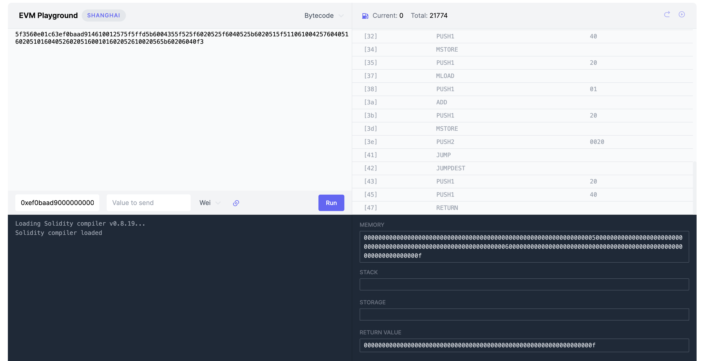

# WTF Huff极简入门: 11. 循环

我最近在重新学Huff，巩固一下细节，也写一个“Huff极简入门”，供小白们使用（编程大佬可以另找教程），每周更新1-3讲。

推特：[@0xAA_Science](https://twitter.com/0xAA_Science)

社区：[Discord](https://discord.gg/5akcruXrsk)｜[微信群](https://docs.google.com/forms/d/e/1FAIpQLSe4KGT8Sh6sJ7hedQRuIYirOoZK_85miz3dw7vA1-YjodgJ-A/viewform?usp=sf_link)｜[官网 wtf.academy](https://wtf.academy)

所有代码和教程开源在github: [github.com/AmazingAng/WTF-Huff](https://github.com/AmazingAng/WTF-Huff)

-----

这一讲，我们介绍如何在Huff中实现循环（Loop）。

## 循环

Huff并不原生支持循环，但是我们可以通过一组跳转标签来实现循环。这一讲，我们将用Huff实现用Solidity写的`sumTo()`函数：

```solidity
function sumTo(uint256 n) public pure returns(uint256){
        uint sum = 0;
        for(uint i = 0; i <= n; i++){
            sum += i;
        }
        return(sum);
    }
```

## 用Huff实现循环

实现逻辑很简单，我们先在循环的开始定义一个跳转标签`loop`，循环的结束定义另一个跳转标签`end`。我们在每次循环体的开头判断循环条件是否仍然成立，如果成立，就运行循环体，更新`i`，跳转到`loop`进行下一个循环；如果不成立，就跳转到`end`，结束循环。

下面，在Huff中使用循环实现`sumTo()`函数的代码：

```c
/* 接口 */
#define function sumTo(uint256) nonpayable returns (uint256)

/* 方法 */
#define macro SUM_TO() = takes (0) returns (0) {
    0x04 calldataload   // [n]
    0x00 mstore         // [] memory: [0x00: n]
    0x00 0x20 mstore    // [] memory: [0x00: n, 0x20: i]
    0x00 0x40 mstore    // [] memory: [0x00: n, 0x20: i, 0x40: sum]

    // 循环
    loop: 
        // 加载 i 和 n，比较 i > n
        0x20 mload 0x00 mload lt // [i>n]
        // 如果大于，则结束循环
        end jumpi       // []

        // 执行循环体，增加 sum 的值
        0x40 mload      // [sum]
        0x20 mload      // [i, sum]
        add             // [sum+i]
        0x40 mstore     // []

        // 增加i
        0x20 mload      // [i]
        0x01 add        // [i+1]
        0x20 mstore     // []

        // 继续循环
        loop jump

    // 循环结束，返回结果
    end:
        // 返回值
        0x20 0x40 return
}


#define macro MAIN() = takes (0) returns (0) {
    // 通过selector判断要调用哪个函数
    0x00 calldataload 0xE0 shr
    __FUNC_SIG(sumTo) eq sum jumpi
    // 如果没有匹配的函数，就revert
    0x00 0x00 revert

    sum:
        SUM_TO()
}
```

## 分析合约字节码

我们可以使用`huffc`命令获取上面合约的runtime code:

```shell
huffc src/11_Loop.huff -r
```

打印出的bytecode为：

```
5f3560e01c63ef0baad914610012575f5ffd5b6004355f525f6020525f6040525b6020515f51106100425760405160205101604052602051600101602052610020565b60206040f3
```

将这段字节码复制到[evm.codes playground](https://www.evm.codes/playground?fork=shanghai)，将`Calldata`设为`0xef0baad90000000000000000000000000000000000000000000000000000000000000005`（调用`sumTo`函数，参数`n`设为`5`）并点击运行。右下角的返回值为`0x00...0f`，也就是`15`（`=1+2+3+4+5`），合约运行成功！



## 总结

这一讲，我们介绍了如何在Huff中使用循环，并在`evm.codes`上成功运行了合约。